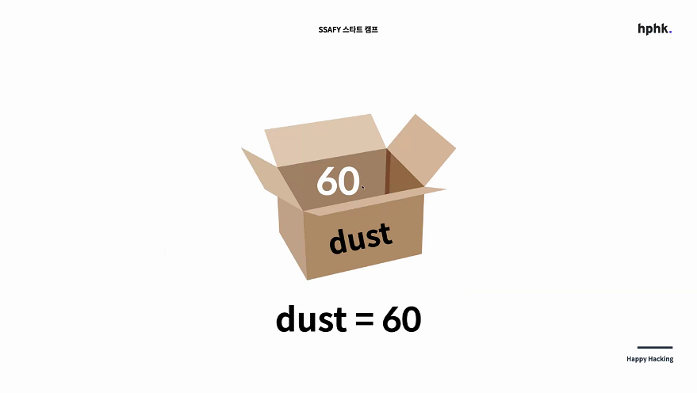

# 프로그래밍 언어


## 시작하기전에 주의할 3가지

```
대/소문자 

띄어쓰기 및 들여쓰기

오타
```

## 저장

- 박스안에 무언가를 넣는다라고 생각하면 편함
- 

- Dust에 60을 저장한다


### What you save

1. 숫자
2. 글자 - 따옴표로 둘러싼 글자 or 숫자
3. 참/ 거짓 - True or False


### How to save

1. 변수(variable) - 저장된 값이 vary하기 때문에 변수. 이 문서에서는 단일 박스로 표현.

   - ```
     print(hello) - 변수 hello에 담긴 내용 출력
     ```

   - ```
     print("hello") - 따옴표에 담긴 내용 Hello 출력
     ```


2. 리스트(list) - 박스의 리스트 (박스가 순서대로 여러개 붙어있다)
3. 딕셔너리(Dictionary) - 견출지 붙인 박스들의 묶음


## 조건

### if/else

- 예시
  - **If** dust >50**:**
  - (앞에 4칸 띄고) print("50초과")
  - **esle:**
    - print("50이하")


딕셔너리 = 단수형, 표의 한 행을 표현하는것이라고 보면 된다.

key는 표의 첫 행