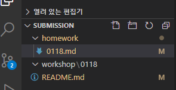

# 챗 봇 만들기

\# 1. 봇생성 in telegram

*\# **2. "WEB + HTTP" : (내 컴퓨터가)요청은 URL로 보내고 (해당 페이지에서)응답이 옴.*** 

***\#          안보내면 절.대.로. 응답 안옴***

\# 3. my bot이 나한테 메세지를 보내도록 하기 위해서는?

## Process

1. python 파일 =====> 요청 to telegram
2. Telegram =====> 응답 to python + 실행 to smartphone 
3. Smpartphone

### 파이썬 파일에 필요한 정보는?

- My bot의 데이터
- '나' 에 대한 데이터
- 요청 내용(message)
- ******URL****** : 앞 3가지 내용을 묶어서 포함시키기.

message_url = f'https://api.telegram.org/bot{bot_token}/sendMessage?chat_id='

                                                                                1. 봇 아이디						?-추가 요청사항 ex)id와 text

## Naver developer -Open API

client ID : 텔레그램의 챗ID 같은 기능

Client Secret: 보안키

header : 인증키를 입력하는 것

## git

|                       | 폴더   | stage  | repository(repo) |
| :-------------------: | ------ | ------ | ---------------- |
|         비유          | 분장실 | 무대   | 앨범             |
| command for next step | Add    | Commit |                  |

-m (메세지를 적는 것.)

-commit 후 file을 변경할 경우 

