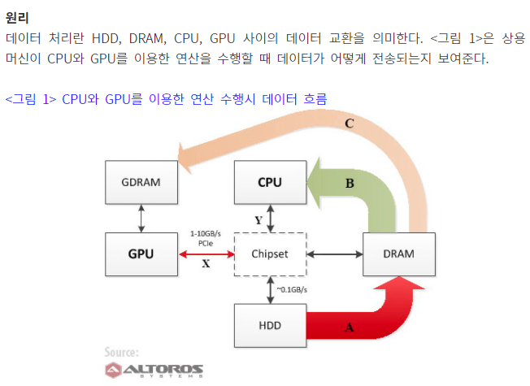

# 분산처리

## 정우기 분산환경의 JOIN은, 보통 디스크, CPU, 네트워크 중 어디에서 병목이 발생할까요? 이를 해결하기 위해 무엇을 해야 할까요?

- JOIN
  - JOIN 또는 결합구문은 데이터베이스 내의 여러 테이블의 레코드를 조합하여 하나의 열로 표현한 것이다.
    - 테이블로서 저장되거나
    - 그자체로 이용할 수 있는 결과 셋을 만들어 낸다.
    - Join은 2개의 테이블에서 각각의 공통값을 이용함으로써 필드를 조합하는 수단이 된다.
- 병목현상
  - Hadoop의 기본구성인 HDFS(Hadoop Distributed File System)의 각 계산 노드의 로컬 디스크상의 디렉토리를 통합하여 구성하게 됨.
  - 특정 키값에 데이터가 편중되어 시스템의 전체적인 limit factor로서 작용
  - TCP/IP, HTTP를 기반으로 구현 -> 이로인한 병목현상
  - 로컬 디스크의 성능에도 영향을 받을 수 있음.
  - CPU의 연산  vs GPU의 연산 -> 노드당 5~25배 정도 업그레이드 가능 
    - 컴퓨팅 속도 자체는 GPU가 약 50~200배 높음.
    - 데이터 전송속도가 느림
      - GPU-DRAM 의 데이터 교환속도는 약 1~ 10GBps
      - CPU-Chipset 사이의 데이터 전송속도는 10~20GBps
    - 

- 해결 방법
  - GPU가 수행하는 연산 수와 비교해 입출력 데이터량이 상대적으로 적을 때 가장 이상적
  - GPU에 능력에 적합한 것.
  - 하둡을통해 독립적인 병렬형 하위 프로세스로 분리할 수 있어야 한다.

참조

- https://scienceon.kisti.re.kr/commons/util/originalView.do?dbt=TRKO&cn=TRKO201500002146
- https://www.itworld.co.kr/news/82563?page=0,0

