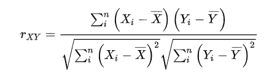
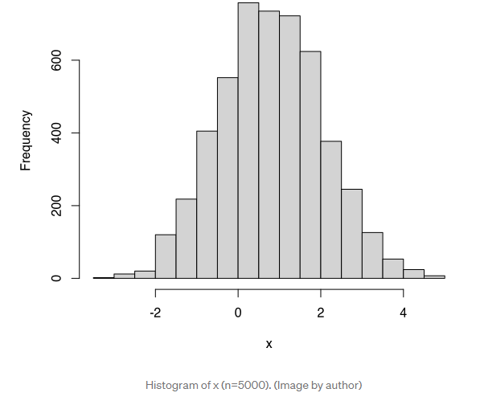
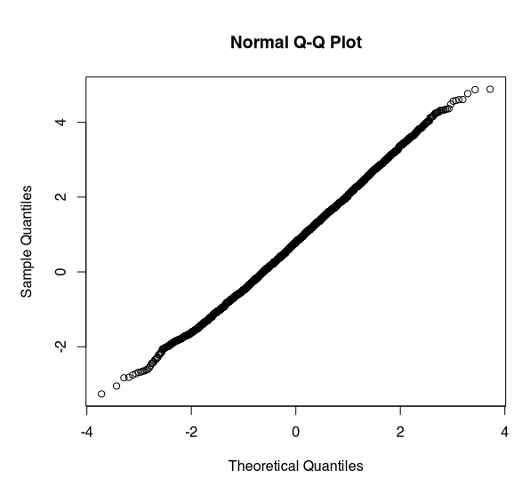

박국현 어떨 때 모수적 방법론을 쓸 수 있고, 어떨 때 비모수적 방법론을 쓸 수 있나요?

-------

박은상 p-value는 요즘 시대에도 여전히 유효할까요? 언제 p-value가 실제를 호도하는 경향이 있을까요? 

-------

박정웅 필요한 표본의 크기를 어떻게 계산합니까? ------- 이현경 중심극한정리는 왜 유용한걸까요?

-------

전예지 콜센터 통화 지속 시간에 대한 데이터가 존재합니다. 이 데이터를 코드화하고 분석하는 방법에 대한 계획을 세워주세요. 이 기간의 분포가 어떻게 보일지에 대한 시나리오를 설명해주세요 

-------

## 정우기 R square의 의미는 무엇인가요?

-------

### R-squared : 모델이 얼마나 input의 change에 대해서 Output의 change가 반영되는지를 나타냄.

#### 정의

- Coefficient of determination
- 0 ~ 1 사이의 값을 가짐.
- 1이면 회귀 분석 선으로 모든 자료를 설명 가능
- 자료의 편차가 클수록 R^2의 값은 작아짐.
- 

#### 알고리즘

  - OLS (Ordinary Least Squares) : used in sklearn LinearRegression
  - Gradient Descent

#### Limitation
  - 회귀모델이 데이터에 대해서 어느정도 편향되어있는지 알 수 없음

#### R값이 크거나 작으면 좋거나 나쁜걸까?

- R값이 매우크면
  - 가능성 1. 매우 편향되어있음
  - 가능성 2. Overfitting되어있음
  - 가능성 3. Data mining and Change Correlations
  - 가능성 4. Trends in Time Series Data
  - 가능성 5. Form of variab

## 정우기:베르누이 분포 / 이항 분포 / 카테고리 분포 / 다항 분포 

### 베르누이 분포/ 이항분포

#### 베르누이 분포

- 확률 이론 및 통계학에서 주로 사용되는 이론으로, 매 시행마다 **오직 두 가지의 가능한 결과**만 일어난다고 할 때, 이러한 실험을 **1회 시행**하여 일어난 두가지 결과에 대해 그 값이 각각 0과 1로 결정되는 확률변수 X에 대해서 

$P(X=0) =q, P(X=1) = p, 0<=p<=1, q= 1-p$

이며, 이항분포의  특수한 사례에 속한다.

표본 데이터가 1개일때 -> 베르누이 분포

표본 데이터가 여럿 -> 이항분포

#### 이항분포

- 연속된 독립시행이 N번 시행되었을 때 각 시행이 확률 p를 가질 때의 확률분포.
- $Bin(x;N,μ)=(_NC_x)μ^x * (1−μ)^{N−x}$
- 기본적인 예 : 
  -  주사위를 10회 던져서 숫자 6이 나오는 횟수를 x라고 할때 x의 분포 (반대는 6이 안나오는 횟수)
  - 아주 많은 인구의 1%가 선천적 쌍커풀이라고 가정하고, 100명을 무작위로 선택하면 선택한 사람 중
    선천적으로 쌍커풀을 가진 사람의 수는 n= 100, u = 0.01인 이항 분포를 따른다.

### 카테고리 분포/다항분포

#### 카테고리분포

- 카테고리 확률변수는 
- 1부터 K까지 정수 K개 가 나옴. 이 정수를 범주값, 카테고리, class라고 함.
- 예를 들면 정육면체 주사위는 K=6인 카테고리 확률분포를 가짐.
  - x=(x1,x2,x3,x4,x5,x6)
  - x= 0 OR 1
    - $$\sum_{i=1}^{6} x_i = 1$$
    - 여러 $x_k$중 단 하나만 1
  - 각각 1이 나올 확률은 모수 $u_k$를 가짐.
  -  모든 모수벡터의 합은 1
    - μ=(μ1,⋯,μK)
    - 0≤μi≤1
    - $$\sum_{i=1}^{6} u_i = 1$$

#### 다항분포

- 카테고리 확률 변수의 데이터가 여럿 있을 때 이 데이터의 합은 다항분포가 된다.
  - ex) 정육면체 주사위를 여러번 던졌을때 해당 조합이 나올 확률.

참고: 위키백과-이항분포 :https://ko.wikipedia.org/wiki/%EC%9D%B4%ED%95%AD_%EB%B6%84%ED%8F%AC

데이터 사이언스스쿨(베르누이분포와 이항분포): https://datascienceschool.net/02%20mathematics/08.02%20%EB%B2%A0%EB%A5%B4%EB%88%84%EC%9D%B4%EB%B6%84%ED%8F%AC%EC%99%80%20%EC%9D%B4%ED%95%AD%EB%B6%84%ED%8F%AC.html

데이터 사이언스스쿨(카테고리분포와 다항분포): https://datascienceschool.net/02%20mathematics/08.03%20%EC%B9%B4%ED%85%8C%EA%B3%A0%EB%A6%AC%EB%B6%84%ED%8F%AC%EC%99%80%20%EB%8B%A4%ED%95%AD%EB%B6%84%ED%8F%AC.html

## 정우기 : 빅데이터 시대에 정규성 테스트가 의미없다는 주장이 있습니다. 맞을까요?

- 정규성 테스트라는 것은 데이터가 정규 분포를 따르고 있는지에 대한 확인.
  => 표본의 크기가 충분히 크지않고 모집단이 정규분포를 따르는지 모를 때 사용.

- 표본이 충분히 크면? => 

  

- p = 0.001. Shapiro-Wilk test

