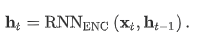
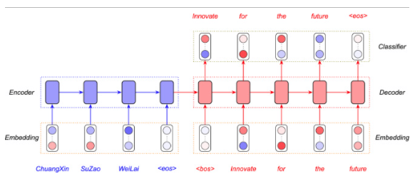

# NLP

- 


- ## Regular grammar는 무엇인가요? regular expression과 무슨 차이가 있나요?

  ### **Regular Expression vs Regular Grammer**

  #### **Regular Expression**

  > 정규표현식, regexp참고)

  python 정규표현식 : https://wikidocs.net/4308

  **특정한 규칙**을 가진 문자열의 집합을 표현하는데 사용

  **사용 예)** 이메일 체크

  https://lh3.googleusercontent.com/proxy/mqweITiexfKfUoqbpUP3UePpAOoGeRZpRraPNiDSX6YOSdrKJnyvqZiKIlTPUolSWDeTxIBxjgWnjAzahyGfJLLdrM-QymV1j1UJ_Gu_m6ex4neqv9AQ7TXLrfp11qPBnDlMSG47fQ-6MAlXRWgFbViCenAmphRyDZHBvec_D-xaXQcUM8rK7U5dAe6j

  HOW?

  ```python
  import re
  p = re.compile('^[a-zA-Z0-9]+@[a-zA-Z0-9]+\\.[a-zA-Z0-9]+$')
  # 영문자, 숫자들로 시작 -> @하나 와야됨 -> 영문자, 숫자들 옴 -> .하나 와야됨 ->
  # 영문자, 숫자들로 끝남
  emails = ['python@mail.com', 'python123@example.com',              # 올바른 형식
            'python-dojang@example.co.kr', 'python_10@example.info',         # 잘못된 형식
            '@example.com', 'python@example', 'python@example-com']          # 잘못된 형식
  
  for email in emails:
      print(p.match(email) != None, end=' ')
  ```

  #### **Regular Grammer**

  > 참고 : http://cs.okstate.edu/~kmg/class/5313/fall13/notes/nine.pdf

  - 정규표현식과 유사하게 특정한 규칙을 바탕으로 문자열의 집합을 표현하는데 사용
  - 정규 문법은 컴파일러의 어휘 분석 단계에서 입력 프로그램을 구성하고 있는 토큰의 구조를 정의하는데 사용

  **구성요소**

  A regular grammar G is a quadruple **(V, Σ, R, S)** where:

  - V is the rule alphabet, which contains nonterminals and terminals
    - {A, a, b}
  - Σ (the set of terminals) is a subset of V
    - {a, b}, 실제 문자열을 이루는 요소
  - S (the start symbol) is a nonterminal.
  - R (the set of rules) is a finite set of rules of the form: X → Y
    - {S -> aS, S -> A, A -> bA, A ->  e}, 이때 은 '끝남' 을 의미

  **example1)**

  위의 예시에서 S는 aS, A 두군데로 갈 수 있고, A는 bA,  두군데로 갈 수 있음

  생성될 수 있는 문자열은 다음과 같으며 무한개의 가지수가 존재 가능.

  a: S -> aS -> A -> e

  ab: S -> aS -> A -> bA -> e

  b, abb, aabb, aaaaabbbbb,...

  이는 정규표현식 `a*b*` 와 같다.

  **example2)**

  그래프로 보면 더 쉬움

  

- ## Stop Words는 무엇일까요? 이것을 왜 제거해야 하나요?

  ### **1. Stop Words는 무엇일까요? 이것을 왜 제거해야 하나요?**

  ```
  갖고 있는 데이터에서 유의미한 단어 토큰만을 선별하기 위해서는 큰 의미가 없는 단어 토큰을 제거하는 작업이 필요합니다. 여기서 큰 의미가 없다라는 것은 자주 등장하지만 분석을 하는 것에 있어서는 큰 도움이 되지 않는 단어들을 말합니다. 예를 들면, I, my, me, over, 조사, 접미사 같은 단어들은 문장에서는 자주 등장하지만 실제 의미 분석을 하는데는 거의 기여하는 바가 없는 경우가 있습니다. 이러한 단어들을 불용어(stopword)라고 합니다.
  
  한국어에서 불용어를 제거하는 방법으로는 간단하게는 토큰화 후에 조사, 접속사 등을 제거하는 방법이 있습니다. 하지만 불용어를 제거하려고 하다보면 조사나 접속사와 같은 단어들뿐만 아니라 명사, 형용사와 같은 단어들 중에서 불용어로서 제거하고 싶은 단어들이 생기기도 합니다. 결국에는 사용자가 직접 불용어 사전을 만들게 되는 경우가 많습니다.
  
  ref: <https://wikidocs.net/22530>
  ```

  - 불용어를 제거하면 데이터 셋 크기가 줄어든다. 비록 데이터 셋이 감소하게 되나 정확성에는 큰 영향을 주지 않고, 모델 학습 시간도 줄일 수 있다.
  - 불용어 제거는 더 적은 수의 중요한 토큰만 선별한다는 것에 의미가 있다.
  - 일반적으로 검색엔진에서는 검색 공간을 줄이기 위해 불용어를 제거한다.

  ## 영화 리뷰가 긍정적인지 부정적인지 예측하기 위해 모델을 어떻게 설계하시겠나요?

  참고: https://tensorflow.blog/케라스-딥러닝/3-4-영화-리뷰-분류-이진-분류-예제/

  **Binary classification** 사용

  이진분류는 한 문제에 예/ 아니오 형태로 구분되는 문제에 적합하다. 따라서 영화 리뷰를 긍정/부정 두가지로 예측하려고 하기 때문에 이진분류로 설계할 수 있다.

  1. 신경망 모델을 만들 때, 얼마나 많은 층을 사용할지, 각 층에 얼마나 많은 은닉 유닛을 둘 지를 생각해야한다.

     - 16개 은닉 유닛을 가진 2개의 은닉층
     - 현재 리뷰의 감정을 스칼라 값의 예측으로 출력하는 세번째 층

     은닉 유닛을 늘리면 신경망이 더욱 복잡한 표현을 학습할 수 있지만 계산 비용이 커지고 원하지 않는 패턴을 학습할 수도 있으니 16개로 한다.

     중간에 있는 은닉층은 활성화 함수로 relu를 사용. 마지막 층은 확률을 출력하기 때문에 시그모이드 함수 사용. (시그모이드 함수가 임의의 값을 0과 1사이로 압축해 출력 값을 확률처럼 해석하기  때문이다.)

  2. rmsprop 옵티마이저 사용, 이진 분류로 각 확률 구하는 모델이니 손실함수는 binary crossentropy 손실 사용.

  3. 에폭을 잘 설정하여 과대적합(overfiting)을 피하기 위해 노력해야한다.

  ## One Hot 인코딩에 대해 설명해주세요

  ```markdown
  - 신경망의 출력 배열 x 에대해서
    - x는 각각 위치의 답이 나올 확률을 표기할때
  - 원-핫-인코딩은
    - 정답을 가리키는 위치의 원소는 1로 그 외에는 0으로 표기하는 표기법이다.
  
  자연어에서 
  원-핫 인코딩을 두 가지 과정으로 정리해보겠습니다.
  (1) 각 단어에 고유한 인덱스를 부여합니다. (정수 인코딩)
  (2) 표현하고 싶은 단어의 인덱스의 위치에 1을 부여하고, 다른 단어의 인덱스의 위치에는 0을 부여합니다.
  
  이해를 돕기 위해서 한국어 문장을 예제로 원-핫 벡터를 만들어보겠습니다.
  
  문장 : 나는 자연어 처리를 배운다
  
  위 문장에 대해서 원-핫 인코딩을 진행하는 코드는 아래와 같습니다.
  ```

  ```python
  from konlpy.tag import Okt  
  okt=Okt()  
  token=okt.morphs("나는 자연어 처리를 배운다")  
  print(token)
  # ['나', '는', '자연어', '처리', '를', '배운다']  
  # 코엔엘파이의 Okt 형태소 분석기를 통해서 우선 문장에 대해서 토큰화를 수행하였습니다.
  
  word2index={}
  for voca in token:
       if voca not in word2index.keys():
         word2index[voca]=len(word2index)
  print(word2index)
  # {'나': 0, '는': 1, '자연어': 2, '처리': 3, '를': 4, '배운다': 5}  
  # 각 토큰에 대해서 고유한 인덱스(index)를 부여하였습니다. 지금은 문장이 짧기 때문에 각 단어의 빈도수를 고려하지 않지만, 빈도수 순대로 단어를 정렬하여 고유한 인덱스를 부여하는 작업이 사용되기도 합니다. (정수 인코딩 챕터 참고)
  
  def one_hot_encoding(word, word2index):
         one_hot_vector = [0]*(len(word2index))
         index=word2index[word]
         one_hot_vector[index]=1
         return one_hot_vector
  
  one_hot_encoding("자연어",word2index)
  [0, 0, 1, 0, 0, 0]  
  # 해당 함수에 '자연어'라는 토큰을 입력으로 넣어봤더니 [0, 0, 1, 0, 0, 0]라는 벡터가 나왔습니다. 
  # 자 연어는 단어 집합에서 인덱스가 2이므로, 자연어를 표현하는 원-핫 벡터는 인덱스 2의 값이 1이며, 나머지 값은 0인 벡터가 나옵니다.
  
  # ref : <https://wikidocs.net/22647>
  ```

  ## 한국어에서 많이 사용되는 사전은 무엇인가요?

  ### **한국어 사전**

  #### **KoNLPy (코엔엘파이): 대표적인 한국어 패키지**

  ##### **형태소 분석기**

  1. 꼬꼬마 ( Kkma)
     - 자바 라이브러리
     - 세종말뭉치 (corpus) 활용
     - 말뭉치 통계 정보 조회, 말뭉치 검색, 한국어 쓰기 학습
     - 오래걸림, 분석 범주가 가장 넓음
     - 띄어쓰기 오류에 덜 민감 하다
     - 정제된 언어가 사용되지 않는 문서에 대한 형태소 분석 정확도가 높지 않다
  2. KOMORAN
     - 자바 한글 형태소 분석기
     - 로딩 시간이 조금 길다
     - 시간이 꼬꼬마에 비해 분석시간이 훨씬 빠르며 정확도도 상위권
     - 외부 의존성이 없어 설치후 바로 사용 가능
     - 개발자가 지속적으로 업데이트 중
     - 적용 분야에 따라 공백이 포함된 고유명사 (영화 제목, 음식점명, 노래재목 등)을 더 적확하게 분석할 수 있다
     - 자소 분리 가능, 오탈자 분석 가능 하지만 띄어쓰기가 없는 문장 분석에 취약
  3. Open Korean Text (OKT)
     - 이전에 트위터로 알려짐
     - 이모티콘이나 # 같은 인터넷 텍스트에 특화된 범주
     - 어근화 가능, 비속어등이 포함된 정제되지 않은 데이터에 대해 강점이 있다
     - 분석 범주가 다른 형태소 분석기에 비해 적음
     - 문장 분리기능 제공
  4. Mecab(은전한닢)
     - 윈도우에서 사용이 어려움 (리눅스 기반) / ios에서 사용 가능
     - 세종말 뭉치
     - 실행시간이 매우 빠름, 정확도 우수
     - 새로운 사전을 추가할 수 있다
     - 띄어쓰기 오류에도 좋은 성능
     - 미등록어 처리, 동음이의어 처리에 문제가 있다

- 정웅: 음성 인식 시스템에서 생성된 텍스트를 자동으로 수정하는 시스템을 어떻게 구축할까요?

  #### **Speach-to-Text**

  음성 인식 시스템에서 생성된 텍스트를 자동으로 수정하는 시스템을 어떻게 구축할까요?

  ## **음성 인식 방법**

  ### **방법 1**

  1. 음성 입력

  [전처리]

  1. 특징 추출 -> `딥러닝`

  [패턴인식]

  1. 음소 인식 -> `딥러닝`
  2. 언어 모델 -> `딥러닝`

  [후처리]

  1. 후처리 -> `딥러닝`
  2. 인식 결과

  ### **방법 2 (End-to-End)**

  1. 음성
  2. 음성 자체를 `딥러닝`에 넣음
  3. 결과

  ## **방법 1의 후처리**

  `필요성`

  - 한국어의 경우, 인식 단위로 의사 형태소를 사용 => 후처리 단계에서 어절 단위로 재구성 필요
  - 인식 결과가 완전하지 않기 때문에 오류 보정을 위한 노이즈 채널 모델이 후처리 단계에서 필요(노이즈 분석)
  - 동어 반복, 추임새, 단어 실수 등 불필요하고 의미 도출에 영향을 줄 수 있는 요소 수정 필요
  - 연속된 음성 속에서 의미 도출을 위한 문장 분리 필요

  `방법`

  - **Sentence segmentation**: 음성 멈춤이나 문장 끝 억양(intonation) 등 특성으로 문장 경계를 나누는 모델
  - **Disfluency detection**: 화자가 잘못 말한 단어를 캐치해 제거하거나 폰트 변화 등으로 표시. 혹은 음성 인식 결과 오류를 바로 잡는 역할

  ### **Sentence segmentation**

  문장 분리는 음성 인식 결과로 출력된 각 단어 사이사이 모두에 대해 문장 `경계`인지(sentence boundary) 아닌지(sentence-internal) 가려내는 **이진 분류(binary classification)** 문제로 볼 수 있음

  

  [문장 분리 모델에 사용되는 분리 방법]

  1. **Duration** : 현재 분석 대상 구간(그림1에서 각 단어 사이사이) 앞에 있는 음소의 길이 정보. 보통 문장 마지막 단어는 길게 발음하는 경향이 있다.
  2. **Pause** : 현재 분석 대상 구간에 휴지(pause)가 끼어 있는지, 있다면 얼마나 긴지에 대한 정보. 대개 사람들은 다음 문장을 말할 때 살짝 시간을 둔다.
  3. **F0 features** : 현재 분석 대상 구간의 피치(pitch) 변화. 문장이 끝날 때는 대개 피치가 발화자의 F0 베이스라인에 가깝게 떨어진다(final fall).

  ### **Disfluency detection**

  문장 중간에 별 의미 없이 말한 ‘아, 음’ 같은 간투사(間投詞), 반복된 단어, 문장의 재시작 등 등이 교정 대상

  

  

  음성 특질(feature)을 활용해 단어와 단어 사이의 경계를 문장 중단(interuption), 문장 재개(repair), 문장 계속(sentence-internal) 등 범주별로 분류

  (상당히 어려운 작업)

  [Disfluency detection 모델에 사용되는 방법]

  1. 품사 등의 텍스트 정보
  2. 피치
  3. 기타 모든 음성 정보

  # **참고**

  > https://www.korean.go.kr/nkview/nklife/2017_4/27_0405.pdf https://blog.ncsoft.com/게임과-ai-6-음성-인식-기술/ https://ratsgo.github.io/speechbook/docs/sophisticated/post#tasks


## Apple이 과일인지 회사인지 어떻게 구분할까요?

### 기존 라이브러리(nltk) : 통계적 NLP 방법

- 단어를 개별적 나눠서 각각의 단어의 의미를 매칭
- one-hot representation
- 문제점:
  - 세부적인 뉘앙스를 파악할 수 없음
  - 신조어에 대한 정보의 부재
  - 주관적인 방법


### Word Embedding

- 기존 라이브러리가 가진 문제점들을 극복하기위해 Distributional similarity based represenatation의 개념이 소개됨 => 타겟 단어의 주변단어를 통해서 단어가 의미하는 바가 무엇인지 찾는 것.

#### word2vec

- 모든 단어를 Vector로 표현해서 단어사의 유사성과 차이점을 계산
- 알고리즘
  - Skip-gram(SG) : 타겟 단어를 이용해 주변 단어의 의미를 파악
  - Continuous Bagof Words(CBOW) : 주변단어를 이용해 타겟단어를 예측


### 참고

- https://sacko.tistory.com/4?category=631408
- https://wikidocs.net/22644


## 영어 텍스트를 다른 언어로 번역할 시스템을 어떻게 구축해야 할까요? 

- 대표적으로 구글 번역에서 사용하는 알고리즘은 NMT(Neural Machine Translation)이다.

  - 정의 : **신경망 기계 번역**(Neural machine translation, NMT)은 일련의 단어의 가능성을 예측하기 위해 [인공 신경망](https://ko.wikipedia.org/wiki/인공_신경망)을 사용하는 [기계 번역](https://ko.wikipedia.org/wiki/기계_번역) 접근 방법으로, 일반적으로 하나의 통합 모델에 문장들 전체를 모델링한다.
  - 분류:
    - 규칙기반(Rule-Based Machine Translation)
    - 통계기반(Statistical Machine Translation)
    - 하이브리드 기반(RBMT+SMT)
  - 

- 알고리즘

  - Encoder-decoder Framework

    - Embedding layer, encoder networks, decoder networks, classification layer 로 구성됨

      - <bos> <eos>는 각각 문장의 시작과 끝을 의미함

      - 1. Embedding layer를 거치면서 자연어를 잘게 쪼개 vector화 시킴

      - 2. Encoder network는 embedding에서 나온 data를 사용하여 RNN 모델을 통한 해석 data 추출

           
           RNN은 variable-length sequences 를 모델링 하기 적합.

        3. decoder network에서 encoding된 데이터를...?

        4. 

    - 

  - 

### 참고

https://www.oss.kr/info_techtip/show/65f88554-1882-4af9-8036-6490d3314c65

Neural machine translation: A review of methods, resources, and tools,(Zhixing Tan et al.) ((https://www.sciencedirect.com/science/article/pii/S2666651020300024))

