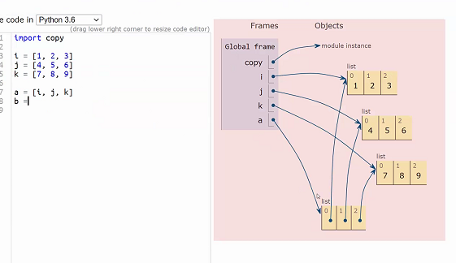

# 2021 01 26

## 데이터 구조 및 활용


### Workshop

- Dict 의 key는 immutable한 속성을 가진 것들만 들어 올 수 있음
- 2번같은경우 .get(blood_type, @) - @를 return


### data structure

- List.extend(a)

  - a에 string이 들어가면 각각의 철자가 분해되서 들어감
  - a에 list가 들어가면 list가 벗겨져서 요소가 추가됨.

- ```
  a = [1, 2, 3]
  clear(a)
  a = []
  ```

- 위에껀 id는 그대로.(박스안에 내용물만 버린것)

- 아래껀 새로운 쓰레기봉투 샀다고 생각하면됨.


#### Copy

```
import copy

i = [1, 2, 3]
j = [4, 5, 6]
k = [7, 8, 9]

a = [i, j, k] - i , j, k로 포인팅.
b = a[:] - i,j,k로 화살표가 감
c = copy.deepcopy(a)  - a의 요소를 전부 베껴서 새로 만듦
```





### 피타고라스의 정리를 list comprehension으로 풀어보자

```python
result = []
for x in range(1, 50):
    for y in range(x, 50):
        for z in range(y, 50):
            if x**2 + y**2 == z**2:
                result.append((x, y, z))
```

는

```python
result = [(x, y, z) for x in range(1, 50) for y in range(x, 50) for z in range(y, 50) if x**2 + y**2 == z**2]
```

와 같은말이다.


## Python 3대 OR

### Generator

- <u>**한번 소비하면 끝이야**</u>
- ex) map 함수의 결과값.

```python
gen = (i for i in range(100))
big_gen = (i for i in range(100000))
list_gen = [i for i in range(100)]
big_list_gen = [i for i in range(100000)]
```

```python
import sys
sys.getsizeof()
```

를 실행해보면 genrator는 얼마나 큰 크기를 만들든 size가 같음

list는 크기가 클수록 size가 큼


### iterator

### decorator

- 두개는 나중에..


## Iterable한 자료의 경우

 x = [1, 2, 3]

list(enumerate(x))

 = [(0,1), (1, 2), (2, 3)]

for idx, i in enumerate(x):  # idx값,  i값을 동시에 다룰 수 있다.


## 할수 있는 행동의 명령어가 기억이 안나

print(dir(a))  - > 해당 자료에 쓸수있는 명령어 출력.

- 