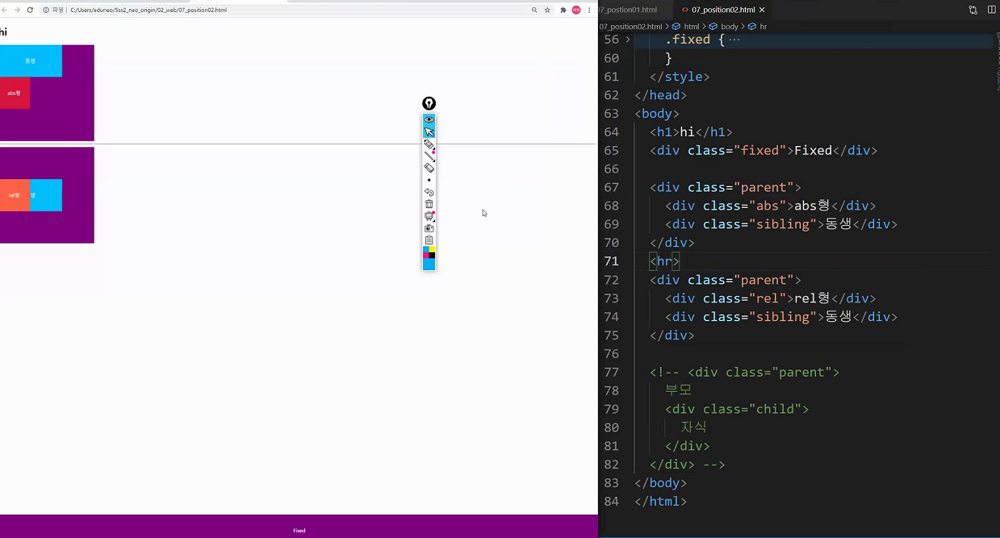
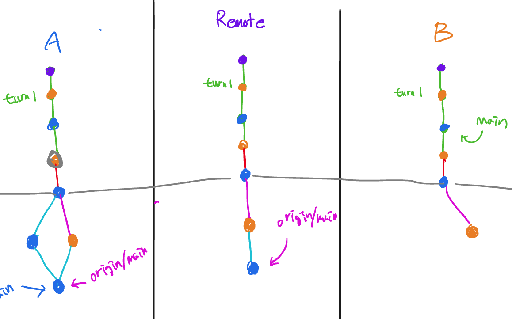
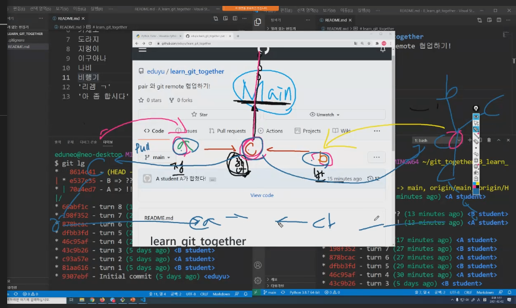

# 2021 02 02

## Web/HTML/ CSS

## CSS

### position

- default : 좌상단 -> 우하단으로 배치됨, static
- relative, absolute, fixed 는 좌표 porperty를 사용하여 이동이 가능.
  - relative : static 위치를 기준으로 이동
  - absoulute : 가까이있는 부모/조상 요소 기준
  - fixed : 브라우저를 기준으로 이동.

1. Static은 Static이야. 안움직이는거야!
2. relative- static기준으로 움직임. 원래 자기가 있어야 될 위치 기준으로 움직이지만 따로 뭐 없으면 static이나 다름없음.
3. absolute - 부모가 평범하면(static이면) 안따라감. 부모없을시 바디기준으로 움직임.
4. Fixed - 스크롤바 내려도 위치 고정.
   - width 100%해도 왼쪽에 margin이 왜 남음??????
     - 브라우저의 배려(default로 설정되어있던 것)때문에 남아있는거야
     - 브라우저의 배려를 날려버리려면 reset css 코드가 필요함. 

1. Absolute는 본인자리를 비우고 동생을 위로 올려보냄
2. relative는 밑에 코드에있는 공간을 잡아먹음

https://flukeout.github.io

-> selector를 어떻게 select해야할지 모를때 좋은 사이트!

## practice

### 1. box_positioning

상속했을때

child의 가로폭(max)는 parent의 가로폭을 가짐

-> 그래서 box가 한줄에 1개씩 나옴

## workshop

### class naming

1. 역할을 명시할 것
2. designning concept가 들어가야 할것.
   - Because concept가 바뀔경우 head의 style만 바꾸면 되기 때문.

#### 내일 미리보기

semantic UI

materialize

bootstrap

 이 3가지 open source CSS를 볼것.

### Git hub

협업할 때 - A가 만들었지만 Remote repo는 일종의 법인개념이 되어버리는거고

지위상 위에있음. 하지만 A,B는 선착순게임이 되어버림.

->이러니까 branch가 필요한거야.

A와 B가 의견충돌이 있으면 Remote에서 공론해서 의견을 정하게됨(무엇을 main으로 만들지)

-> 정반이 합쳐져서 합이 다음 main branch가 됨.

