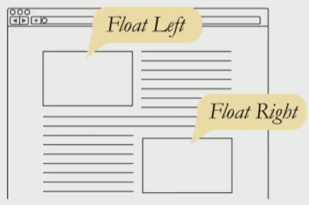
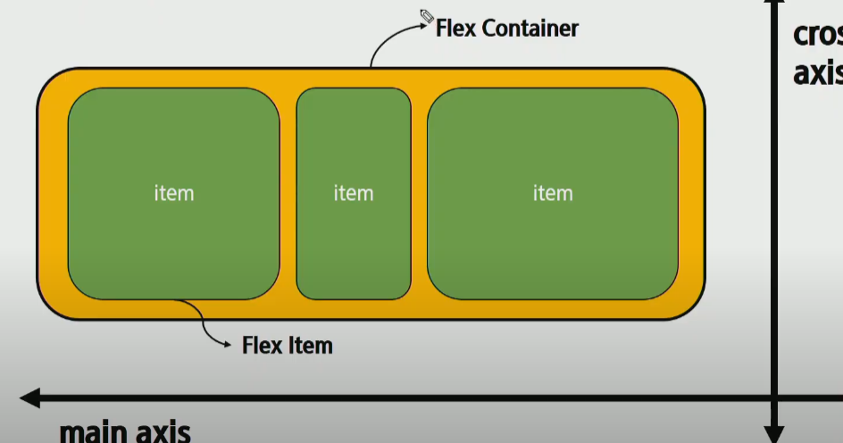
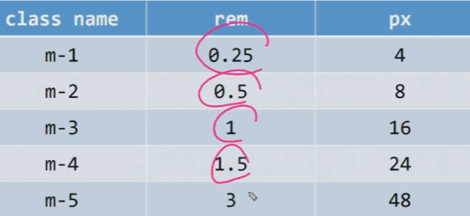
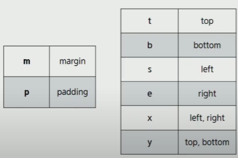
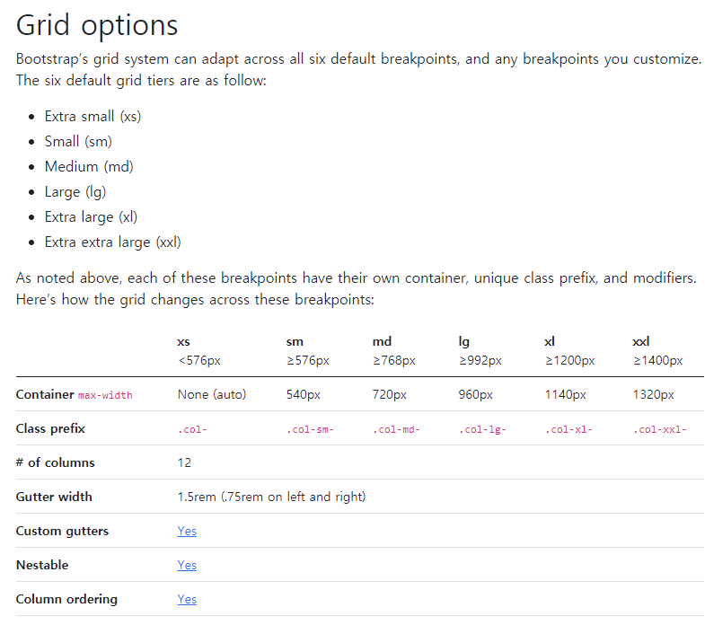
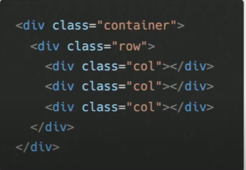

# Web/ CSS

## CSS Layout

- 웹페이지에 포함되는 요소를 취합하고 어디에 놓을지 제어하는 기술

### 종류

- display
- position
- float
- flexbox
- grid

### Float

이미지 좌, 우측 주변으로 텍스트를 둘러싸는 레이아웃을 위해 도입.

text와 별개의공간을 생성하여 띄운다고 보면 됨.

- None
- Left
- Right

문제 - float가 다른 box를 이동시키거나 다른 box의 내용을 가려버려서 문제야 -> 부모태그에 clearfix를 적용시켜서 float box밑에 투명한 빈 박스를 만들어서 접근을 막는 방법으로 layout이 깨지지않게 해.

### CSS Flexible Box layout

- 요소간 공간배분과 정렬을 위한 1차원(단방향) 레이아웃

- 자식 선택자에 대해서만 flexboxing이 적용됨.

  #### 요소 Container, item

  - Container로 모든걸 조종함.

  #### 축 Main axis cross axis

- **부모 요소에 display: flex or inline-flex를 작성하는것 부터 시작**

#### 속성

##### axis

- 배치 방향설정 :flex-direction
  - main - axis방향만 바뀜. because 1차원 레이아웃이기때문.
  - row(x축)이 default.
  - column(y), column-reverse, row-reverse가 있음.
- 메인축 방향 정렬 : justify.
  - space between: item 간 좌우정렬, space around : item간 너비가 외곽 요소의 2배, space-evenly : item간 너비와 외곽너비가 같음
  - flex-start : 시작점부터 양의방향 정렬, flex-end 끝의 점부터 음의방향정렬
  - center: items가 여백없이 center에 모여있음
- 교차축 방향 정렬 : align (위에서 아래로가는게 양의방향, 반대가 음의방향임 보통은.)
  - align items(container가 조작함. 즉 부모요소에 부여해야됨): stretch(default), flex-start, flex end, baseline(기준점을 잡아줌.)
  - align self : flex-start, center, flex-end

- flex-flow : flex-direction과 wrap의 shorthand

##### container

- content : 여러줄
- items : 한줄
- self : item 하나
  - order : 0이 default로 맨처음에 오는것. item 각각에 주게 되는데 item간 order값을 비교해서 순서가 정해짐.
  - flex-grow: 주축의 남는공간에서 item.grow/(grow총합)만큼 해당 아이템에 주게됨

## Bootstrap

### bootstrap을 적용할 시

- 똑같은 h1 이더라도 font, margin 등등 사용자 설정이 default로 들어가있음. -> 레이아웃이 원하는대로 안될 가능성 up.
- bootstrap 적용시 css를 reset시켜서 초기화.(bootstrap.reboot.css 파일이 bundle안에 적용되어있음.)
  - reboot파일에 normalizing도 포함. 

#### CDN (Content Delivery(distribution) Network)

- 컨텐츠를 효율적으로 전달하기 위해서 여러 노드에 가진 네트워크에 데이터를 제공하는 시스템.

  : 개별 end-user의 가까운 서버를 통해 빠르게 전달 가능.

    본서버에 걸리는 부하가 적어짐.

### 사용해보기

#### .mt-1 ?

- 설정되있는 html의 값은 16px

- .mt-1 Margin Top - 1 = 0.25rem

  

- mx-0 => margin-right, margin-left : 0 auto
- py-0 =? padding-top, padding-bottom : 0
- 

s - start, e - end

## Responsive web design

### Bootstrap grid system

- 

- bootstrap grid system은 총 6개의 breakpoint를 가진다

  - display의 area px에 따라 보여지는 기준을 나눠놓은것.
  - 

  - xs는 실질적으로 안사용함.

#### structure

- 12 columns

  - 12라는 수는 약수가 많아서 layout 잡기가 편함.
  - col에 숫자를 따로 부여안하면 균등배분

  

- 위 사진은 grid system의 기본 구조. 컨로콜(컨테이너-row-column) 구조로 구성된다.
- col-@ 일때 @들의 합은 12일때 각자의 숫자에따라 배분됨.
  - 12를 초과했을땐 다음행으로 넘어감.
  -  9 , 4, 3 적었을경우는? 4, 3이 아랫칸으로