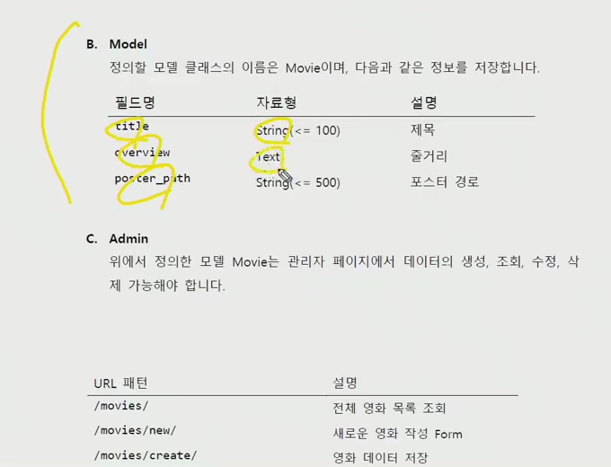
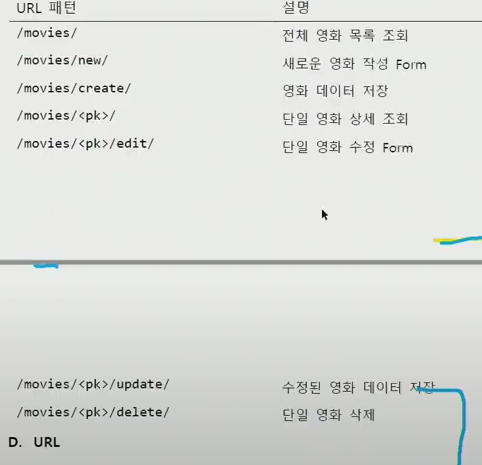

# 2021 03 12

## pair PJT

- DB는 서로 공유하는 거 아님.

- Dumpdata를 통해 fixture(initial data)..

- `python manage.py dumpdata app_name.class`

  위 명령어를통해 dump 데이터를 생성할 수 있다.

- dumpdata와 appname 사이에 옵션을 줄 수 있다.

  - --indent (default to None): 아웃풋의 들여쓰기 조절
  - --format (default to Json) : formatting
  - --all
  - --exclude(=-e) : prevent app_label.Modelname이 dumping되는걸 막는것

공유할 때 ->app 안에 Fixtures/app_name 이라는 폴더를 만들어서 dumpdata를 저장.

공유 받을 때 ->  `python manage.py loaddata app_name/app_name.json`

- DB에 저장됨.

신경써야될 것.

- 패키지관리
- Fixture관리

makemigrations -> MOdels.py 를 SQL언어로 번역된 migration 파일을 만들어줌.

