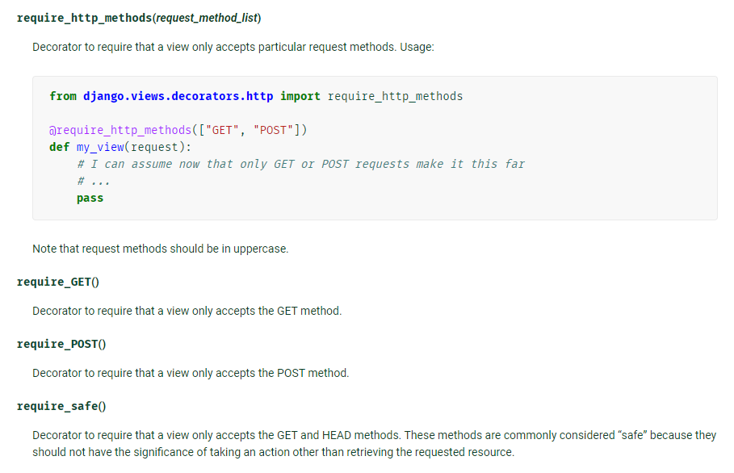

# 2021 03 17

## Form

- 유효성 검사 도구
- 공격 및 우연한 데이터 손상에대한 중요한 방어수단

- 역할
  - 렌더링을 위한 데이터 준비 및재구성
  - 데이터에 대한 HTML Forms재구성
  - 클라이언트로부터 받은 데이터 수신 및 처리


### Form class

- form 내 field, filed배치, 디스플레이 widget, label 초기값, 유효하지않은 field관련 에러메세지 결정

- 반복코드 줄임

- 작성

  - app/forms.py

  - ```python
    from django import forms
    
    class Article(forms.Form):
        title = forms.Charfield(max_length = @)
        content = forms.Charfield(widget=forms.Textarea)  
        # widget을 사용해서 input type을 바꾸는 형태
    ```

  - Widget

    - 웹페이지의 html input요소 렌더링 및 제출된 원시데이터 추출을 처리
    - widget은 반드시 form fields에 할당.


### Model class

- model을 통해 form class를 만들 수 있는 helper

- Meta class라는 부분이 존재

  - ```python
    class ArticleForm(forms.ModelForm):
        class Meta:
            model = Article  # 참조할 모델의 클래스명, 호출아님. 등록의 개념.
            fields = '__all__'  
    ```

- 위젯이 다를 수 있으므로 꼭 '공식문서'를 볼 것.

### Form & ModelForm

- model에 연관되지 않은 데이터 : Form class
- model에서 양식에 필요한 대부분의 정보를 이미 정의했을 때 :ModelForm class
- ModelForm
  - Model과 관련없는 column을 넣었을때
    - DB에는 해당 Column없음
    - 데이터 증발함
  - Model에 있는 column을 넣었을때
    - DB에 해당 column있음
    - 해당 Data의 추가 상세설정 가능.


## 코드작성은 데이터흐름을 따라 가는게 정석이야.


## Form rendering

- 공식문서참조
- Rendering fields manually
  - 각각의 div에 css적용
  - bootstrap에도 form class있으니 참조. 
- Automatically하게 출력되려면?
  - Forms.py
  - widget의 attrs={'class':'bootstrap의 class name'}을 추가!
- Error메세지의 경우도 css줄수있는 방법에 대해서 공식문서에 나와있어.


- 일일이 위젯 적용하는것도 귀찮아... ->장고 부트스트랩 lib 존재함!

  - django-bootstrap-v5.. pip install
  - app 등록

  - HTML 문서 안에서 `{% load bootstrap5 }`태그로 bootstrap 적용가능


## Base.html

- base도 뭐 여러개 넣다보면 너무 커져버려
  - 이런 것을 해결하기위해 include tag가 존재
  - include tag는 템플릿에 써져있는 것을 고대로 가져오는것!


## Decorator

- 기능을 추가하고싶을때, 기존 기능을 수정하지 않고 기능을 연장!

- 기본적으로 다양한 데코 지원

- Allowed HTTP METHODs

  - 요청 메서드에따라 view함수에 대한 액세스를 제한
  - 조건 미충족시 HttpResopnseNotAllowed를 return

- view 함수 위에 @데코 형식으로 작성.

  


- 데코레이터가 있으면?
  - 올바른 요청이 아닐때에 대한 구문이 필요가 없어.(처리해야 할 method가 1가지일때)
  - 올바른 요청이 아닐 때는 http status code 405가 뜸
    - 