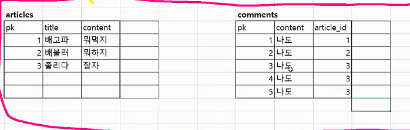
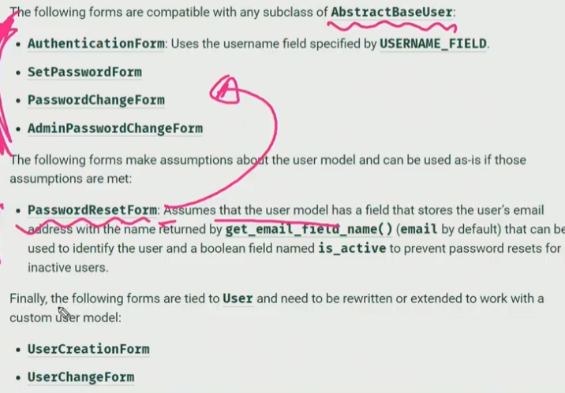

# 2021 03 24


## Model relationship

- 말하는건 그대로인데 누가 누구랑대화하는지 결정하는거야.

모델간 관계를 나타내는 필드

- Many to one
  - ForeignKey()
- Many to many
  - ManyToManyField()
- one to one (1:1)
  - OneToOneField().

#### 특징

- 유일한값을 참조함.
  - 데이터의 참조 무결성.
    - 데이터의 정확성과 일관성을 유지


### Foreign key

- RDBMS에서 한 테이블의 필드중 다른 테이블의 행을 식별할 수 있는 키
- 참조하는 여러개가 -> 참조되는 동일한 행 참조 가능
- 참조하는 테이블과 참조되는 테이블이 동일할 수 있음(대댓글)

필수 인자

- 참조하는 모델 : 클래스 변수이름_id로 해서 column이 만들어짐.

- On_delete 옵션

  - Foreignkey가 참조하는 객체가 사라졌을 때 Foreignkey를 가진 객체를 어떻게 처리할지 정의

  - 무결성을 지키기 위해서 필요.

  - ```
    Cascade : 부모 객체가 삭제되었을 때 참조한 객체도 삭제
    Protect: 참조가 되어있는 경우 오류 발생
    Set_null
    Set_default
    set()
    Do_Nothing
    Restrict(New in 3.1.)
    
    ```

  - ```django
    article = Article(title = '제목1', content= '내용1')
    comment.article = article  # comment(N)가 article(1)참조.
    comment.save()
    ```

  - 장고에서는 역참조시 모델이름_set형식으로 역참조

  - ```django
    article.comment_set.all()
    ```

  - 

ㅇ`comment = comment_form.save(commit=False)`

- commit=False할 경우 instance는 만들어주지만 DB에 저장은안함.

- 따라서 instance에 추가적인 데이터를 첨부한 후 세이브할 수 있는 기회를 얻음.


댓글 개수 출력

```django
# html페이지에서
{{ comments|length }}
{{ article.comment_set.all|length }}
{{ comments.count }}

# 3개의 출력결과는 같다.
# 위의 2개가 실행속도가 좀 더 빠름.
```


Commentform에서 field를 `'__all__'`로 주고 html에 `comment_form.content`이런식으로 쓰면 에러뜨지만 field를 ('content', )를 주고 `comment_form.as_p`를 출력하면 정상작동된다... 뭔차이인지모르겠다..


## Modeling




## 커스터마이징 authentication in django

### User model 대체하기

- built-in user model이 제공하는 인증 요구사항이 적절치않을 수 있음.

- Custom usermodel을 사용한다면 기본 usermodel을 override하여 필요한 부분에 맞춤설정할 수 있기 때문.

- #### ***첫 migration 하기 전에 해야함***

  - 연계되어있는 것이 너무나 많기때문에 중간에 초기화 못함.


#### setting하기

- AUTH_USER_MODEL ='accounts.User'
  - 첫 마이그레이션 할때 대체가 되어있어야함.

- accounts.models

  - ```python
    from django.contrib.auth.models import AbstractUser
    
    class User(AbstractUser):
        pass
    
    
    ```

- accounts.forms
  - 

- UsercreationForm과 UserChangeForm에서 User가 auth.User가아니라 accounts.User가 되도록 대체해야됨.

  - `User = get_user_model()`

  - ```django
    class CustomUserCreationForm(UserCreationForm):
    	class Meta(UserCreationForm.Meta):
    		model = User
    		fields = UserCreationForm.Meta.fields + ('custom_field',)
    ```

    - custom field에는 유저 클래스에 클래스변수가 있어야됨!!


#### Article에 참조하기

```python
from django.conf import settings

class Article(models.Model):
    user = models.ForeignKey(settings.AUTH_USER_MODEL, on_delete=models.CASCADE)
```

- MODELS.PY에서는 이렇게 참조시켜야됨


다른곳에서는?

- from django.contrib.auth.models import get_user_model

- `User = get_user_model()`


WHY?

- settings.AUTH_USER_MODEL = > return 'accounts.User'
  - installed_apps에 accounts 보다 더 위에 있는 app이 있으면, 그 앱에서 makemigration 할 때 get_user_model()은 auth.User를 참조하게됨
  - 하지만 문자열로 주어지면 어느 위치에 들어가있든 동일한 유저모델을 참조하게 됨.
  - 따라서 models.py에서 유저모델을 불러올 때 settings.AUTH_USER_MODEL을 작성할것!
- get_user_model() => return user object.