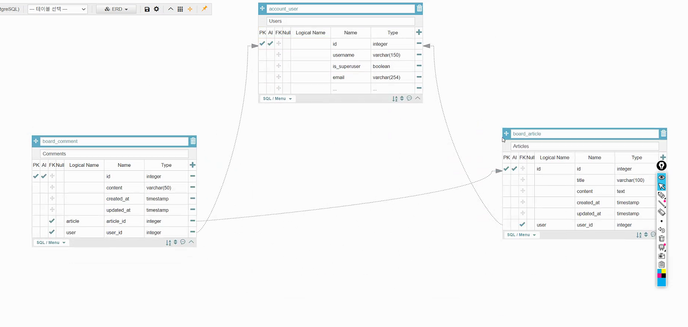
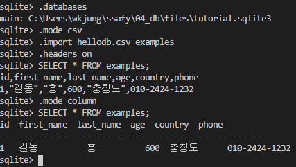

# 2021 03 25

## DB Modeling

- RDBMS Relational DB Management System
  - Oracle
  - Postgres
  - MySQL
  - SQlite - 혼자 파일 하나에..
- No SQL
  - MongoDB
  - Firebase


- ERD
  - Entity Relation Diagram
  - 


## SQL

- Structured Query Language
  - ***Query : 질의, 명령***
  - Structured : 구조화된,

- terminal에서 .으로 시작하는 언어는 해당프로그램 전용 명령어 ex) sqlite> .databases

### 문법

- DDL: Data Definition Language(데이터 정의 언어)
  - 관계형 데이터 베이스의 구조를 정의하기위한 명령어
  - Models.py에서 하는일(Table 생성, 수정, 삭제)
- DML: Data Manipulation Language(데이터 조작 언어)
  - 저장, 수정,삭제,조회
    - Insert : Create
    - Update
    - Delete
    - Select: Read
- DCL: Data Control Language(데이터 제어 언어)
  - 권한 제어를 위해 사용
    - commit:
    - rollback: 


- 예시
  - 


### Read

- SELECT 명령어는 Create, delete와 다르게 데이터 자체의 변화가 없음
  - SELECT * FROM table_name = 전체조회 in table_name
  - SELECT column,column2 FROM table_name = column, column2 in table_name
  - column, column2를 괄호로 묶으면? -> 동작안함
    - why?
  - SELECT * FROM table_name LIMIT 숫자1 OFFSET 숫자2= 테이블에서 숫자2번 부터~숫자2+숫자1번 까지 가져옴.
    - LIMIT 다음 OFFSET이 나와야함.

#### Search

- Select 구문 후 where 'column_name' ='value'; 일 경우

  column_name에서 'value'값이 똑같은 경우만 가져옴.


- SELECT DISTINCT age FROM classmates;
  - {for age in ages}라고 보면 됨. 즉 중복되는값 제거.


### Delete

- DELETE FROM table_name WHERE column=value;
  - TABLE에서 column=value의 row를 다날림
  - WHERE가없다면 -> table의 뼈대빼고 다날림

- id는 delete한거 재사용 x (if primary KEY AUTOINCREMENT를 사용할경우)
  - sqlite는 보통 autoincrement 권장안함


### UPDATE

- UPDATE table_name
- SET column=value
- WHERE condition


### Expression

```sqlite
SELECT COUNT(*) FROM users;

SELECT AVG(age) FROM users
WHERE age >= 30;

SELECT count(age) FROM users
WHERE age >= 30;
```


count - row가 몇개인지

AVG - 평균

MAX(integer column) - 가장 큰값


### Like

_ : 반드시 들어가야됨

%: 있어도되고 없어도되고.

```sql
SELECT * FROM users
where age>=20 and age< 30;

SELECT * from users
where age like '2_';

-- 두 결과값은 동일함.
```


### Order

ORDER BY 'column_name1', 'column_name2'

- name1으로 일단 정렬 후 name1에 가장 위에있는 순에서 name2를 재정렬

- ex)

- ```sql
  SELECT * from users
  order by last_name, age asc limit 20;
  -- 결과는 성이 '강'씨 인 사람들 중에서 age 오름차순 정렬
  ```

- ```sql
  SELECT * from users
  order by age, last_name asc limit 20;
  -- 결과는 age가 어린사람중에 성을 ㄱㄴㄷ순으로 정렬.
  ```

- 


## ORM

## and / OR

- filter(x=1, y=2)도 되고

```python
from django.db.models import Q
Model.objects.filter(Q(x=1) & Q(y=2))
```

도되고

```python
Model.objects.filter(x=1) & Model.objects.filter(y=2)
```

도 된다.


하지만 or는

```python
Model.objects.filter(x=1) | Model.objects.filter(y=2)
from django.db.models import Q
Model.objects.filter(Q(x=1) | Q(y=2))
```


는 SQL에서

```sql
SELECT ... WHERE x=1 OR y=2
```

이다.


- queryset.vaules('알고싶은 칼럼 네임') = 칼럼:값으로 출력
- values() : 전체칼럼 출력

- 장고는 똑또캐서 queryset[idx1:idx2]로하면
  - 자동으로 idx1은 offset, idx2는 limit로 넣고 SQL 구문을 작동시킨다.