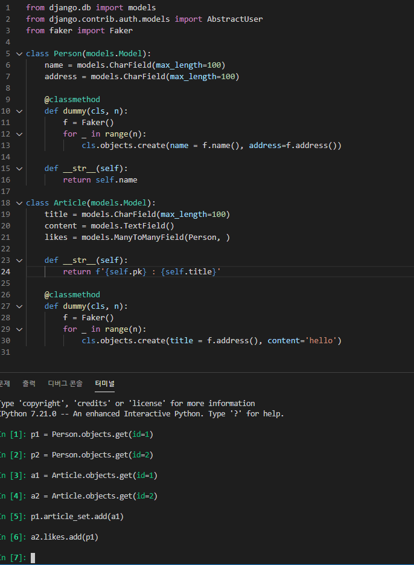
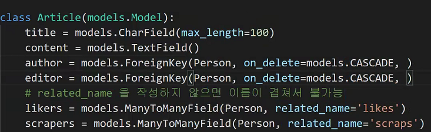

# 2021 03 31

## Many to Many Fields

- Many to manyField일때 참조한대상.attr_name.add(참조받는대상)
- add() - 추가
- remove() - 삭제

- 다음과 같이 하면 Article에 dislike_users = models.ManyToManyField(Person)을 추가한다 하면?

  - p1.article_set.all()이 likes인지 dislikes인지 몰라

  - 그럼 dislike_users = models.ManyToManyField(Person, related_name = 'dislikes')로 변경하면

  - p1.dislikes.all() -> p1이 싫어요누른 게시물을 전부 보여주는거야. article_set이라는 명령어가 안겹치니까 상관없이 작동할 수 있어!

    

- 하지만 주의할점 : model에 관련한 table을 날려먹으므로 애초에 모델을 잘 짜야돼. 기존 데이터 날려먹기싫으면.

- DB에서보면 article과 person table에는관련정보 x. MTOM 정보는 다 다른테이블에 있어

- FK를 동일클래스에 참조한다고 해도
  - person에서 매니저가 article_set이 되버림
    - related_name을 써줘야 작성자, 에디터가 구분이 가능하겠지?

## When QuerySet is evaluated

- **Iteration**
- Slicing
- Caching
- **Repr()**
- len()
- list()
- **bool()**

- 위와 같은 경우 query가 DB로 send. (limit factor로 작용.)
- filter를 아무리 많이달아도 DB에는 보내지않아!
  - 따라서 Queryset을 되도록 적게 만들어야해.
  - index를 통해서 DB에서 뽑는 경우는 Queries the database again