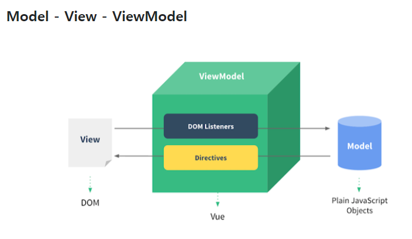
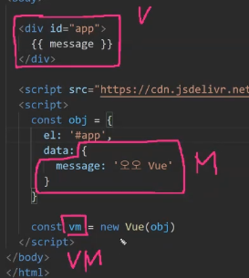
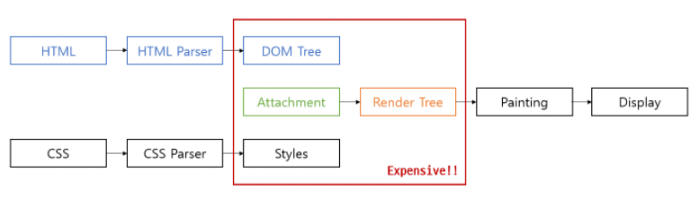

# 20210506

- SPA
  - Single Page Application

- CSR
  - Client Side Rendering
  - 사용자가 render를 하도록 하는 것
    - JavaScript
  - server- client 트래픽 감소 => UX 향상
  - 검색엔진 최적화에 문제가 발생할 수 있음.
- SSR
  - Server Side Rendering
  - 서버가 render를 하는것
    - Django-HTML

## Vue.JS

- Template를 서버에서 client사이드로 넘기게됨!

- DOM과 DATA가 연결되어있으면 Data를 바꾸면 모든 Object가 바뀌게되므로
  - Data에대한 관리만 하면 됨.

- 코드작성
  - Data 로직작성
  
  

### MVVM pattern

- ViewModel : Data와 DOM의 중개를 담당
- View : HTML ( 자동으로 만들어짐 )
- Model : {key:value}, javascript objects.

- 

#### MVVM pattern의 장점

- 
- 웹페이지가 파싱과정을 거쳐 render Tree가 만들어지고 display되는데, DOM에서 작은 수정이 생길때마다 렌더링과정이 반복되어 부하가 커짐.
- 이에반해 VueJS에서 사용하는 가상 DOM은 자바스크립트 객체의 일종으로 메모리상에서 관리되어 실제 렌더링 X => 가상 DOM을 업데이트하는데는 비용이 매우 적게듦. => 실제 DOM과 가상DOM의 다른부분만 수정하여 반영하고 한번에 렌더링함. => 부하 감소.

### 브라우저

#### Vue tab

- 나오는걸 볼 수 있는것!

#### console

- 오류가 나오는 것

### 문법

#### 렌더링

##### v-text

- 해당 data의 text를 있는 그대로 보여주는것

##### v-html

- 해당 데이터에 tag가 있다면 tag를 인식해서 렌더링해줌

##### v-show

- 해당하는 값이 true or false이냐에 따라서 display 여부를 결정해줌.
- js는 true, false를 소문자로 쓰니 유의

##### 조건부 렌더링

- v-if, v-else-if, v-else
  - if->else-if->else 순으로 조건문 확인

##### v-for

- data에 있는 array를 읽어서 각각의 객체에대한 정보를 불러들어옴.
- JS가 아닌 문법사용가능

### Method

- Method 안에서 This = Vue obj를 뜻함.
- 대부분의 동작(data setting)

#### v-on

v-on:"event" = "function"

== @"event"="function"

- event
  - click
  - input(input data가 달라질때마다 변화)
    - ex) 검색엔진에서 검색어를 칠때마다 추천 검색어가 바뀌는것.
  - change(focus에서 벗어날 때 변화된 input data를 적용.)

#### v-model

- input과만 사용. 중간과정에서 개입불가.

### Computed

- data getting(연산된 결과의 data)\
- **return이 반드시 필요해**
- **종속된 값이 변화하지않는한** 값을 캐싱(저장)해놓기떄문에 한번 저장한 값을 계속 갖고옴.