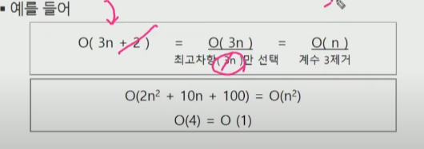
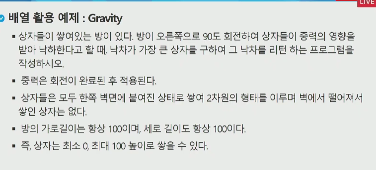

# Algorithm

- 유한한 단계를 통해 문제를 해결하기 위한 절차나 방법.
  - 정확성 : 얼마나 정확하게 움직이는가
  - 작업량 : 적은연산으로 result를 뽑는가(=시간복잡도)
  - 메모리사용량 : 적은 메모리를 사용하는가
  - 단순성 :얼마나 단순한가
  - 최적성 : 최적화

## 표현방법

1. Pseudo code
2. 순서도

### Time complexity

실제 걸리는 시간을 측정

실행되는 명령문의 개수를 계산!

#### 빅 -오(O) 표기법

-  Big-Oh Notation
- 시간 복잡도 함수중에서 가장 큰 영향력을 주는 n에 대한 항 only 표기
- 계수는 생략하여 표기
- 

## List

### What is list?

- 일정한 자료형의 변수들을 하나의 이름으로 열거하여 사용하는 자료구조.

### Why list?

- 프로그램 내에서 여러개의 변수가 필요할 떄, 일일이 다른 변수명을 이용하여 자료에 접근하는 것은 
  매우 비효율적일 수 있다.
- 배열을 통해 하나의 선언을 통해서 둘 이상의 변수를 선언 가능
- 다수의 변수로는 하기 힘든 상황을 쉽게 해결할 수 있다.

### 1차원 배열

- Arr  = [0] * n 같은 식으로 1차원 배열을 선언
- 접근 방식
  - Arr[0] = 10 // 배열 Arr의 0번째 원소에 10을 저장해라

#### 1차원 배열 활용 예제

## 정렬

- 2개이상의 자료를 특정 기준에 의해 작은값부터 큰값 (오름차순, ascending) 혹은 큰값부터 작은값으로 (내림차순, descending)재배열하는것.  
- 종류
  - 버블정렬
  - 카운팅 정렬
  - 선택 정렬
  - 퀵 정렬
  - 삽입 정렬
  - 병합 정렬