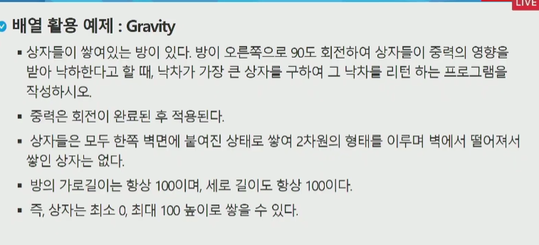

# Algorithm


- 유한한 단계를 통해 문제를 해결하기 위한 절차나 방법.
  - 정확성 : 얼마나 정확하게 움직이는가
  - 작업량 : 적은연산으로 result를 뽑는가(=시간복잡도)
  - 메모리사용량 : 적은 메모리를 사용하는가
  - 단순성 :얼마나 단순한가
  - 최적성 : 최적화
- 성능 측정
  - 작업량비교
    - 시간복잡도 (실행되는 명령문의 개수를 비교하여 실제 걸리는 시간 비교)
      - Big-O 표기법
      - 가장 큰 영향력을 주는 N항(limit factor) 만 표기
      - 계수 생략
      - 연산 수 :log n < n < n*log n < n^2< 2^n < n!
      - 


- 표현방법
  - Pseudo code
  - 순서도


## List

### What is list?

- 일정한 자료형의 변수들을 하나의 이름으로 열거하여 사용하는 자료구조.


### Why list?

- 프로그램 내에서 여러개의 변수가 필요할 떄, 일일이 다른 변수명을 이용하여 자료에 접근하는 것은 
  매우 비효율적일 수 있다.
- 배열을 통해 하나의 선언을 통해서 둘 이상의 변수를 선언 가능
- 다수의 변수로는 하기 힘든 상황을 쉽게 해결할 수 있다.


### 1차원 배열

- Arr  = [0] * n 같은 식으로 1차원 배열을 선언
- 접근 방식
  - Arr[0] = 10 // 배열 Arr의 0번째 원소에 10을 저장해라

#### 1차원 배열 활용 예제




### Baby-gin game

- 0~9사이의 숫자 카드에서 임의의 카드 6장을 뽑았을 때(중복허용), 3장의 카드가 연속적인 번호를 갖는 경우를 run, 3장이 동일한 경우를 triplet
- 6장의 카드가 run, triplet으로 구성된 경우를 baby-gin


```python
num = int(input())
c = [0]* 10
for i in range(6):
    c[num % 10] += 1
    num //= 10
    
i = 0
tri = run = 0
while i < 10:
    if c[i]>=3:
        c[i] -= 3
        tri += 1
        continue
    if c[i] >=1 and c[i+1] >=1 and c[i+2] >=1 and i<7:
        c[i] -=1
        c[i+1] -=1
        c[i+2] -= 1
        run += 1
        continue
    i += 1

if run + tri ==2:
    print('baby-gin')
else:
    print('fail')

```


### 정렬

- 2개이상의 자료를 특정 기준에 의해 작은값부터 큰값 (오름차순, ascending) 혹은 큰값부터 작은값으로 (내림차순, descending)재배열하는것.  
- 종류
  - 버블정렬
  - 카운팅 정렬
  - 선택 정렬
  - 퀵 정렬
  - 삽입 정렬
  - 병합 정렬


#### Bubble sort

- 인접한 두 원소를 비교하여 계속 교환

- Time-complexity : O(n^2)

- ```python
  def bubblesort(a): # 정렬할 list
      for i in range(len(a) - 1 , 0, -1): # 범위의 끝이 끝에서부터 하나씩 줄어듦
          for j in range(0, i):
              if a[j] > a[j+1]:  # 오름차순. 내림차순은 부등호가 반대.
                  a[j], a[j+1] = a[j+1], a[j]
  ```


#### Counting sort

- 카운트를 위한 공간을 설정하기 위해서 ***"집합 내 가장 큰 정수"***를 알아야 한다.
- Time-complexity: O(n+k)


```python
def Counting_sort(A,B,k):
    # A [1 .. n] == 입력배열 (최소 1 최대값 k)
    # B [1 .. n] == 정렬배열
    # C [1 .. k] == 카운트배열
    
    C = [0] * k
    for i in range(0, len(B)):
        C[A[i]] += 1
    for i in range(1, len(C)):
        C[i] += C[i-1]
    for idx in range(len(B)-1 , -1, -1):
        B[C[A[idx]]-1] = A[idx]
        C[A[idx]] -= 1
```

#### Seltction sort

- 셀렉션 알고리즘 : 저장되어있는 자료로부터 k번째로 큰 or 작은 원소를 찾는 방법을 셀렉션 알고리즘이라 한다.
  - 선택과정
    - 1. 정렬 알고리즘을 이용하여 자료를 정렬
    - 2. 원하는순서에 있는 원소 가져오기.

- ex) k번째로 작은 원소를 찾는 알고리즘

  - ```python
    def select(list, k):
        for i in range(0, k):
            minIndex = i
            for j in range(i+1, len(list)):
                if list[minIndex] > list[j]:
                    minIndex = j
            list[i], llist[minIndex] = list[minIndex], list[i]
        return list[k-1]
    ```

  - 


## List_2

### 숫자퍼즐


```python
sort_num = [[0]*6 for _ in range(6)]
for i in range(6):
    for j in range(6):
        if i//3 ==0 and j//3 == 0:
            sort_num[i][j] += 2
        if i//3 == 1 and j//3 == 0:
            sort_num[i][j] += 3
        if i//3 == 0 and j//3 == 1:
            sort_num[i][j] += 1
        if i//3 ==1 and j//3 == 1:
            sort_num[i][j] += 4

```

### 2차원 배열

- 세로 길이 = row의 갯수
- 가로 길이 = column의 갯수(= len(row))


#### 행 우선 순회

```python
for i in range(len(Array)):
    for j in range(len(Array[i])):
        Array[i][j]  # 필요한 연산 수행
```


#### 열 우선 순회

```python
for i in range(len(Array)):
    for j in range(len(Array[i])):
        Array[j][i]  # 필요한 연산 수행
```


#### 지그재그 순회

```python
for i in range(len(Array)):
    for j in range(len(Array[i])):
        Array[i][j + (m -1 -2 * j) * (i%2)]  # 필요한 연산 수행
```


#### 델타를 이용한 2차원 리스트 탐색

```python
arr[0...n-1][0...n-1]
dx[] <- [0, 0, -1, 1]  # 상하좌우
dy[] <- [-1, 1, 0, 0]

for x in range(len(arr)):
    for y in range(len(arr[x])):
        for i in range(4):
            testX = x+ dx[i]
            testY = y+ dy[i]
            arr[testX][testY]  # 필요한 연산 수행
```


#### 전치행렬

```python
# nxn행렬에서만 사용 가능

for i in range(n):
    for j in range(n):
        if i < j:
            arr[i][j], arr[j][i] = arr[j][i], arr[i][j]
```


#### 부분집합

```python
dk gn = len(arr)

for i in range(1<<n):  # 1<<n: 부분집합의 개수
    for j in range(n+1):  # 원소 갯수만큼 비트 비교
        if i & (1<<j):  # i의 j번째 비트가 1이면 j번째 원소 출력
            print(arr[j], end=', ')
    print()
print()
```


## 검색

### 순차 검색

- 일렬로 되어있는 자료를 순서대로 검색하는 방법.
- 단순하여 구현은 쉽지만 검색대상의 수가 많은 경우에는 수행시간이 급격히 증가

#### 정렬되어있지 않은 경우

- 첫번째 원소부터 검색대상과 키값이 같은 원소가 있는지 비교

- 찾으면 검색중단, 못찾으면 리스트 끝까지 감.

  - 평균 검색회수 = (n * (n+1) / 2) /2
  - 시간복잡도 - O(n)

- ```python
  def sequentialSearch(a, n, key):
      i = 0
      while i <n and a[i] != key:
          i = i+1
      if i < n : return i # (or a[i])
      else: return -1
  ```

#### 정렬되어있는 경우

- 오름차순으로 정렬된 상태에서 검색한다면
  - 순차적으로 검색하면서, 원소의 키값이 검색대상의 키값보다 크면 찾는 원소가 없다는 것이므로
    더 이상 검색하지않고 검색을 종료.

- 평균 비교회수가 반으로 줄어듦
- 시간복잡도 : O(n)

```python
def sequentialSearch(a, n, key):
    i = 0
    while i <n and a[i] < key:
        i = i+1
    if i < n and a[i]= key: return i # (or a[i])
    else: return -1
```


### 이진검색

- 반드시 ***'정렬된상태'*** 에서 써야함

- 가운데 키값과 비교하여 다음 검색의 위치를 결정하고 검색을 새로 수행

- ```python
  def binarysearch(a, key):
      start = 0
      end = len(a) - 1
      while start <= end:
          if a[(start+end)/2] > key:
              end = (start+end)/2 -1
          if a[(start+end)/2] < key:
              start = (start+end)/2 +1
          if a[(start+end)/2] == key:
              return true
      return false        
  ```

- 


## 어려웠던 실습문제

### 달팽이문제


```python
for tc in range(1, int(input()) + 1):
    N = int(input())

    c = 0
    count = 1

    arr = [[0] * N for _ in range(N)]  # NxN 행렬 만들기
    while N - 2 * c > 0:  # N
        i_start = c
        j_start = c
        while N ** 2 - (N - 2 * (c)) ** 2 + 1 <= count < N ** 2 - (N - 2 * (c + 1)) ** 2 + 1:  # NxN행렬에서 1이상 N**2-(N-2c) **2이하까지 외곽에 채워짐.
            # 5x5를 생각했을 때 5칸, 4,4, 3,3, 2,2, 1,1칸이 채워짐.
            arr[i_start][j_start] = count
            if i_start == c and c <= j_start < N - 1 - c:  # 첫줄 1채우기
                j_start += 1
            elif j_start == N - 1 - c and i_start < N - 1 - c:  # 끝줄은 row가 1씩 증가하면서 채워짐
                i_start += 1
            elif i_start == N - 1 - c and c < j_start <= N - 1 - c: # 오른쪽아래에서 왼쪽아래까지 왼쪽으로 채워짐
                j_start -= 1
            elif c < i_start <= N - 1 - c and j_start == c:  # 왼쪽아래에서 올라가면서 채워짐.
                i_start -= 1
            count += 1
        c += 1
    if N % 2:  # N이 홀수일때는 가운데가 while문으로 안채워지므로 따로 추가.
        arr[N//2][N//2] = N**2

    print('#{}'.format(tc))
    for i in range(N):
        for j in range(N):
            print(arr[i][j], end=' ')
        print()  # row가 끝날때마다 enter쳐서 줄간격 띄워주기.
        

```


## String

### 컴퓨터에서의 문자표현

- 영어 = 대소문자 합쳐서 52가지 -> 6비트(2^6 = 64)면 모두 표현 가능
- But, 문자를 표현하는 코드가 지역마다 다 다름
- 코드를 통일 시킨 것이 ASCII code (American Standard Code for Information Interchange)
- 7bit 인코딩으로 출력불가능한 제어문자, 공백을 비롯한 95개의 출력가능 문자들로 이루어져 있다.
- + 확장아스키는 8bit 사용하는 문자코드 but 개발자마다 다름.


- 인터넷이 전 세계로 확장되면서 각국의 코드체계가 공유되지 못하여 잘못해석하는 경우가 발생
  - 다국어 표준 = unicode
    - UCS-2, UCS-4 - 이 파일이 UCS2, UCS4인지 인식하고 각 경우를 구분해서 구현해야하는 문제가 발생함
    - 그래서 나온 체계가 UTF-8(web), UTF-16(mac, windows, java), UTF-32(unix)이다.


### Python에서 문자열 처리

- Sequence
- Immutable
- iterable


#### 제공되는 메서드

replace(old, new[, count]) - old를 new로 count횟수만큼 앞에서부터 바꿈

split(separator) - separtor 기준으로 string을 분리함.

isalpha() - 앞이 알파벳인지아닌지 True, False로 반환

find('str') - 해당 string에서 맨앞에 해당하는 글자가 어느 index에 위치하는지. 없을경우 -1반환.


#### 연습문제

- 문자열 뒤집기

  - 자기문자열에서 뒤집는 방법

    - ```python
      def reverse(a):
          swap = ''
          for i in range(len(a)//2 -1, -1, -1):
              swap = a[len(a)-1-i] + swap + a[i]
          return swap
      ```

  - a[::-1]

  - 새로 리스트를 만들어서

    - ```python
      def reverse(a):
          list_a = list(a)
          rev_a = ''
          for i in range(len(list_a)-1,-1,-1):
              rev_a += list_a[i]
          return rev_a
      ```

  - ''.join(list(a).reverse)

- 문자열 비교

  - ```python
    for tc in range(1, int(input())+1):
        str1 = input()  # 짧은 문자열
        str2 = input()  # 긴 문자열
        N = len(str1)
        M = len(str2)
        sum_str1 = 0
        sum_str2 = 0
        for n in range(0,N):
            sum_str1 += ord(str1[n])  # ASCII코드로 변환해서 합을 구함
    
        count = 0
        for i in range(0, M-N+1):
            sum_str2 = 0
            count_right = 0
            for n in range(0, N):
                sum_str2 += ord(str2[i+n])
                if str2[i+n] == str1[n]:  # ascii 코드 합 뿐만아니라 실제로도 문자가 같은지.
                    count_right += 1
            if sum_str1 == sum_str2 and count_right == N:
                count += 1
    
        print('#{} {}'.format(tc, count))
    ```


### 패턴 매칭

#### Brute-force

- 완전탐색.

#### KMP

#### 보이어무어