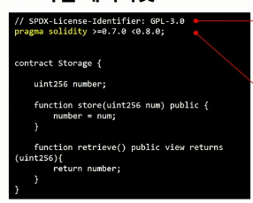

# Solidity Contract

## 기본구조

- 소스 코드의 SPDX라이센스를 명시하도록 권장
- 솔리디티 컴파일러버전 명시




- 컨트랙트의 범위 : contract ContractName {}
- 상태변수 (state variable)
  - function 안적혀진것
  - 블록체인에 상태가 동기화
  - 접근제어자 지정가능
  - 위 사진에서는 uint(부호없는 정수)256 number;
- 함수
  - 컨트랙트의 단위기능
  - 매개변수, 제어자, 반환값 지정가능.
  - return이 있는경우 리턴값의 유형을 지정해주어야함. 
  - constructor 함수 = solidity가 생성될때 작동하는 특수함수.
  - payable - 이더를 받을 수 있는 함수. 
  - 유효성 체크 함수
    - if문은 require문으로 변환이 가능.
    - require(판별문, "에러메세지")
    - 판별문이 true가 아닌경우 에러메세지가 출력되고 함수가 즉각적으로 종료.  

- Mapping 함수

  - Mapping tpye은

    - ```solidity
      mapping(_KeyType => _ValueType) _VariableName
      ```

    - _KeyType은 built-in value tpye, bytes, string, contract등이 올 수 있다

      - user-defined or complex type(mapping, structs, array type)은 불가능

    - Value type은 아무거나 올 수 있다.

    - 
