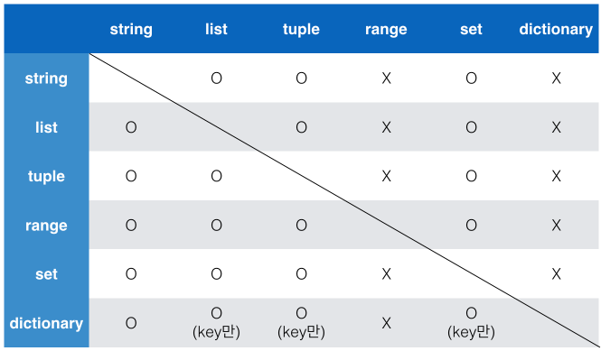

# 컨테이너

- Container: 여러개의 값을 저장 할 수 있는 객체
  - Sequence : 순서가있는, index로 찾을 수 있는 데이터
  - Non-sequence : 순서가 없는, index로 찾을 수 없는 데이터

## Sequence

- It is ordered

- is not sorted.

  

1. 특징
   - 순서를 가질 수 있다
   - 특정 위치의 데이터를 가리킬 수 있다.
2. 종류
   - List
   - Tuple
   - Range
   - String
   - (Binary)(다루진 않았음)

### List

------

- 대괄호[] 및 list()를 통해 만들 수 있다.

- 값에 대한 접근은  listi[i]를 통해 가능

- index는 0부터 시작함.

### Tuple

---

- 소괄호 ()로 표현, tuple()을 통해 만들 수 있다.
- 수정 불가능
- 소괄호가 생략되는 경우도 많음. x ,y = 1, 3 

### Range

---

- Range는 숫자의 시퀀스를 나타나기 위해 사용
- Range (int(start), int(end), int(step))
- Start부터 End까지 Step 만큼의 차이를 가진 등차수열 형성
- Required: int(end), Optional: int(start), step, 각각의 기본값은 0, 1
  * [range(0, 3)] != [0, 1, 2]
  * [range(0, 3)] == [(0,1,2)]

### 활용할 수 있는 연산자/함수

- x in (sequence) / x not in (sequence) 
  - True or False
- (sequence1) + (sequence 2)

- (sequence) *n 
  - ex) [0] * 6 = [0, 0, 0, 0, 0, 0]
- sequence[i] - indexing
- s[i:j] : index i이상 j 미만까지 slice
- s[i:j:k] : index i이상 j미만까지 k 간격으로 slice
  - i default = 0
  - j default = len(s)
  - k default = 1
    - Default
- len(s) / min(s) / max(s) : length, min, max
- s.count(x): x의 개수

## Non-sequence

### set

- 순서가 없는 자료구조
- {}, set{}을 통해 만들어짐
- ***중복*** 이없다.

### Dictionary

- 순서 없음. == index로 데이터값을 찾을 수 없음
- {key: value, }형식으로 이루어짐
- key값에 중복 허용 안됨

## 데이터 형변환

### 변경 불가능한 data

- Literal
  - 숫자(number)
  - 글자(string)
  - 참/거짓(Bool)
- Range()
- Tuple()
  - t= (1, 3) 일때는 t[0] =2 라는 코드를 집어넣으면 typeError : 'tuple' object doesnot support item assignment라는 에러가 뜸. immutable하기때문에.

### 변경 가능한 data

- list
- dict
- set

