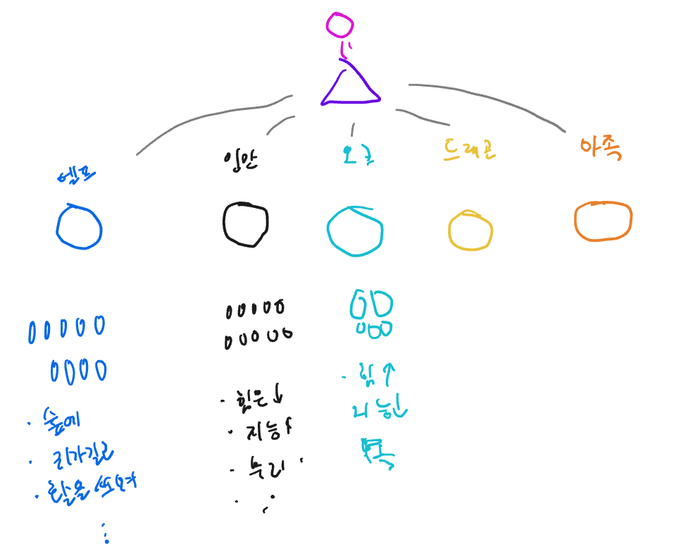
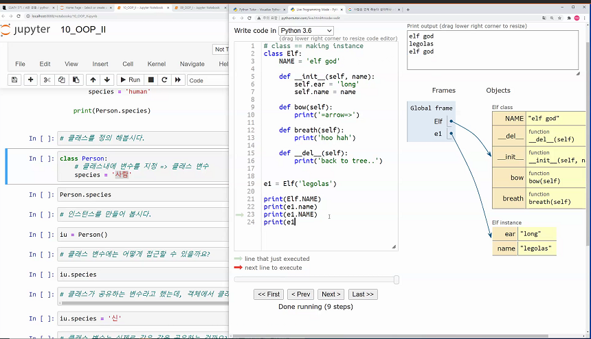

# OOP 

- Object Oriented Programing


## 1. 객체

- python에서 모든것은 객체다.

- 특징

  - Type
  - Attribute(속성)
  - Method(메서드)

- 명사형(객체)가 들고있는 데이터(속성)과 행동(메서드)

  ### 

  쉽게 든 예시 ver.양판소.

### 1-1 타입, 인스턴스

---


### 1-2 속성, 메서드

---


### 1-3 클래스

---

1. 클래스

   ```python
   # class naming은 관습적으로 띄어쓰기, 언더바없이 띄어쓰기 할 때 대문자를 쓴다.
   class ClassName:  
       statement
   ```

2. 인스턴스

   - Class에 속한 객체 = class의 instance
   - 3가지 타입의 메서드에 접근가능
   - 하지만 인스턴스가 취할 행동은 인스턴스 메서드로 한정지어 설계한다.

3. 메서드

   - Class에만 정의된 함수, 적용가능한 행위 = method

   3-1. Self

   - Self: 인스턴스 자신
   - 인스턴스 메서드는 호출시 첫번째 인자로 인스턴스 자신이 전달되게 설계됨.

   ### 매직메서드

   - 메서드()하지 않고 '메서드' '인스턴스' 라고 명령하게 됨.
   - 언더바 *2 가 감싸고있음 ex)생성자, 소멸자 메서드

   1. 생성자 메서드
      - ```python 
       __init__
       ```
   
   
   2. 소멸자 메서드
      
      - ``` python
        __del__
        ```
   
   ​     


## 2. Method의 구분

### 인스턴스 메서드

- 호출 시, 첫번째 인자로 인스턴스 자기 자신 self가 전달됨
- self 에 값이 없을 시 Class에 있는 값을 가져옴.
- 

### 클래스 메서드

- 호출 시, 첫번째 인자로 class가 전달됨.
- @classmethod 데코레이터를 사용하여 정의
- 클래스가 사용할 매서드

### 스태틱 메서드

- 호출 시, 어떤 인자도 전달되지 않음
- 클래스가 사용할 매서드
- @staticmethod 데코레이터를 사용하여 정의

