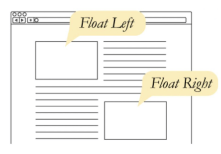
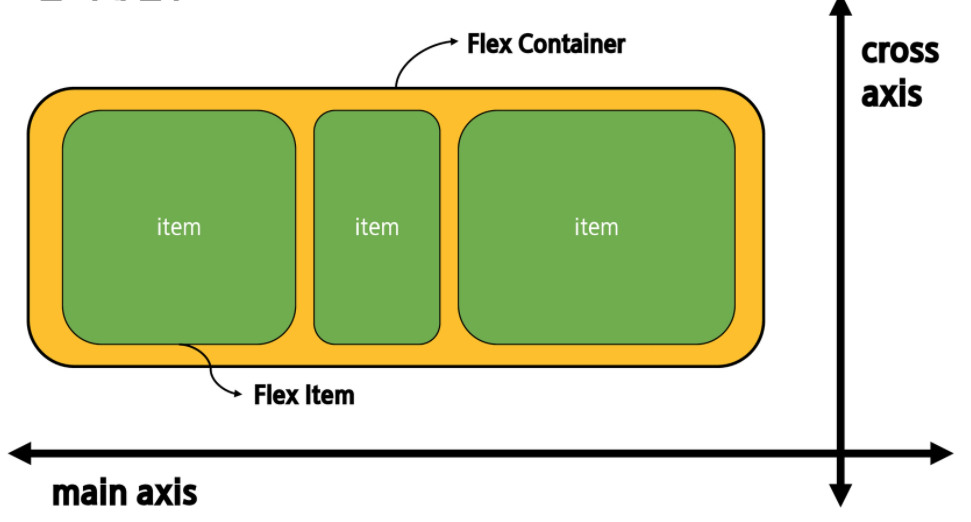
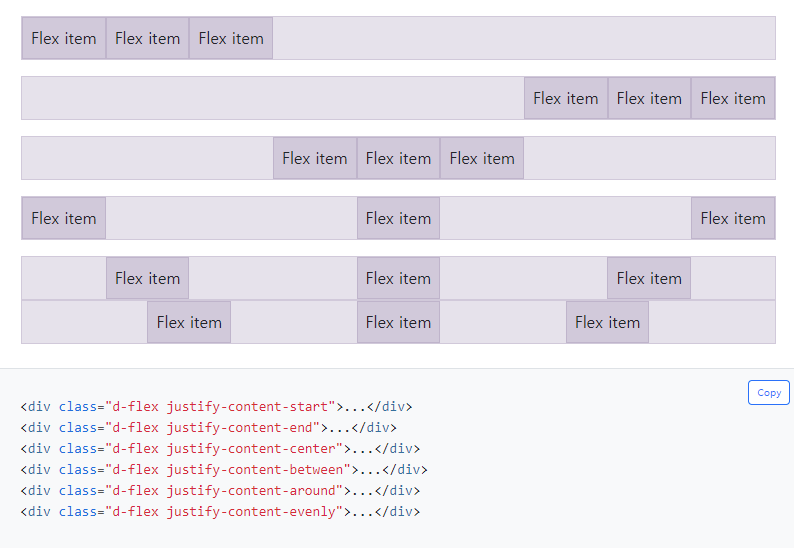
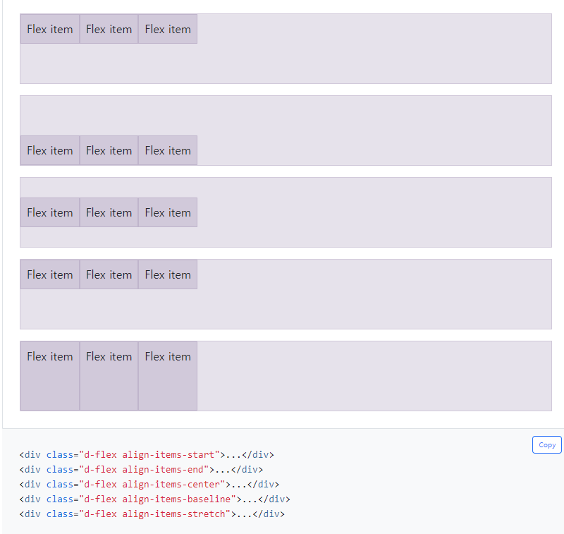

# CSS

## 정의방법

### 인라인

- 해당 태그에 직접 style 속성 부여

### 내부참조

- <head>내 <style>에 태그에 따른 스타일 지정.

### 외부참조

- <head> 내 <link>를 통해 외부 css파일 loading.

## 선택자

### 조합선택자

1. 그룹 선택자 : 서로 다른 선택자가 같은스타일을 적용할경우
   
   - 콤마로 연결 가능
2. 자식 선택자: x 아래 계층구조에서 바로 아래 오는 자식요소 y 만을 선택
   
- 선택자와 선택자는 ">"로 구분 ) x > y
   
3. 자손 선택자 : x 아래 계층 구조에서 모든 자손 y 를 선택
   
   - 선택자와 선택자는공백  " "로 구분 x y
   
     #### 조건부 style
   
     - id > tag x:nth-child(n) : id의 자식 중에서 n번째 자식이  tag x면 적용됨 (tag x가 아니면 적용안됨.)
     - id > tag x.nth-of-type(n) : id의 자식 중에서 tag x를 가진 자식들을 찾아서 n번째 tag x에게 style 부여.

### 선택자 우선순위

- !important : 무조건 첫번째
- 인라인/id/class/요소 선택자

## 단위

### em/rem

1. em
   - 절대단위를 명시하지않으면 상위요소로부터 상속됨.

   - 상위 요소의 폰트크기 = 1 em

     - em을 쓰는 이유

       : html요소 말고도 다른요소의 폰트크기에 따라서 변할 수있음

       -> 상황에 어울리는 변동성 부여

2. rem
   - html 요소의 폰트 크기에 따라 결정

   - html요소의 폰트크기 = 1 rem

     - rem을 쓰는 이유:

       1. 상속 특성에 상관없이 일관된 크기를 돌려줌

       2. 사용자가 설정한 폰트크기에 따라 모든 구성요소가 적절하게 반응

          -> 사이트 레이아웃이 적절히 조정될 수 있도록 하게 함.

## Display 

### Block

- 줄 바꿈이 일어나는 요소
- 화면 크기 전체의 가로폭을 차지
- 블럭요소 안에 인라인 요소가 들어갈 수 있음.
- div/ ul,ol,li/ p/ hr/ form 등

### Inline

- 줄바꿈이 안일어나는 행의 일부 요소
- content 너비 = 전체 너비
- width, height, margin-top, margin-bottom 지정 불가능
- 상하 여백은 line-height로 지정

### inline-block

block과 inline레벨 요소의 특징을 모두 가짐

- inline처럼 한줄에 표시 가능
- block처럼 width, height, margin 지정가능

### none

화면에 표시 X(box 공간이 아예 없어짐)

- visually: hidden 은 해당 요소가 공간은 차지하나 화면에 표시만 하지않는다.

## Position

- #### Static : 디폴트값

  - 기본적인 요소의 배치순서에 따름(좌측상단 -> 하단으로 가는 순서)

- #### Relative : 

  - Static 위치를 기준으로 이동
  - Top, left, right, bottom
    - Top: 100px 은 top에서부터 100px떨어진다는 것.

- ### absolute:

  - 가까이있는 **'Static이 아닌'** 부모/조상 요소를 기준으로 이동
  - 

- ### Fixed

  - 부모요소와 관계없이 브라우저를 기준으로 이동(고정위치)

## Img

- alt : alternative의 약자, 그림이 표기가 안될 시 대체메세지가 출력
- src: 이미지의 경로. 보통 상대경로 or link로 적는 편
  - 상대경로는 terminal에 입력하는것처럼 **'자신의 위치 기준'**
  - 웹에서 참조하는 경우 이미지를 불러오는 시간이 상대적으로 오래걸림.

## Float

- Float된 이미지 좌, 우측 주변으로 텍스트를 둘러싸는 레이아웃을 위해 도입
- 
- Float하면 그 자리는 비운거라고 보면됨. -> 다른 블럭이 차지하게 됨.

## Flex box

- 요소간 공간 배분과 정렬기능을 위한 1차원(단방향)레이아웃

- 요소
  - Flex Container(부모 요소)
  - Flex item(자식 요소)
- 축
  - Main axis
  - Cross axis

- Flex-direction
  - Row, row-reverse, column, column-reverse
- Justify-content
  - 
- Align-items : cross axis을 기준으로 items를 정렬.
- Align-content
- 
- Align-self : item 각각에 cross axis 정렬
- flex-wrap, flex-flow : flex-flow는  flex-direction flex-wrap 을 연속적으로 작성.
- order : 숫자가 낮을수록 먼저나옴.